# Gas Town Architecture

Gas Town is a multi-agent workspace manager that coordinates AI coding agents working on software projects. It provides the infrastructure for spawning workers, processing work through a priority queue, and coordinating agents through mail and issue tracking.

**Key insight**: Work is a stream, not discrete batches. The Refinery's merge queue is the coordination mechanism. Beads (issues) are the data plane. There are no "swarm IDs" - just epics with children, processed by workers, merged through the queue.

## System Overview

```mermaid
graph TB
    subgraph "Gas Town"
        Overseer["👤 Overseer<br/>(Human Operator)"]

        subgraph Town["Town (~/gt/)"]
            Mayor["🎩 Mayor<br/>(Global Coordinator)"]

            subgraph Rig1["Rig: wyvern"]
                W1["👁 Witness"]
                R1["🔧 Refinery"]
                P1["🐱 Polecat"]
                P2["🐱 Polecat"]
                P3["🐱 Polecat"]
            end

            subgraph Rig2["Rig: beads"]
                W2["👁 Witness"]
                R2["🔧 Refinery"]
                P4["🐱 Polecat"]
            end
        end
    end

    Overseer --> Mayor
    Mayor --> W1
    Mayor --> W2
    W1 --> P1
    W1 --> P2
    W1 --> P3
    W2 --> P4
    P1 -.-> R1
    P2 -.-> R1
    P3 -.-> R1
    P4 -.-> R2
```

## Core Concepts

### Harness (Town)

A **Harness** is the installation directory where Gas Town lives - the physical root of your workspace. The terms "harness" and "town" are often used interchangeably:
- **Harness** = physical (the directory at `~/gt/`)
- **Town** = logical (the Gas Town workspace concept)

A harness contains:
- `CLAUDE.md` - Mayor role context (Mayor runs from harness root)
- `mayor/` - Mayor configuration, state, and registry
- `.beads/` - Town-level beads (gm-* prefix for mayor mail)
- `rigs/` or rig directories - Managed project containers

Create a harness with `gt install`:
```bash
gt install ~/gt --git  # Create harness with git
```

**See**: [docs/harness.md](harness.md) for comprehensive harness documentation, including:
- Beads redirect patterns for complex setups
- Multi-system sharing (PGT/GGT coexistence)
- Harness templates for organizations
- Migration between harnesses

### Rig

A **Rig** is a container directory for managing a project and its agents. Importantly, the rig itself is NOT a git clone - it's a pure container that holds:
- Rig configuration (`config.json`)
- Rig-level beads database (`.beads/`) for coordinating work
- Agent directories, each with their own git clone

This design prevents agent confusion: each agent has exactly one place to work (their own clone), with no ambiguous "rig root" that could tempt a lost agent.

### Overseer (Human Operator)

The **Overseer** is the human operator of Gas Town - not an AI agent, but the person who runs the system. The Overseer:

- **Sets strategy**: Defines project goals and priorities
- **Provisions resources**: Adds machines, polecats, and rigs
- **Reviews output**: Approves merged code and completed work
- **Handles escalations**: Makes final decisions on stuck or ambiguous work
- **Operates the system**: Runs `gt` commands, monitors dashboards

The Mayor reports to the Overseer. When agents can't resolve issues, they escalate up through the chain: Polecat → Witness → Mayor → Overseer.

### Agents

Gas Town has four AI agent roles:

| Agent | Scope | Responsibility |
|-------|-------|----------------|
| **Mayor** | Town-wide | Global coordination, work dispatch, cross-rig decisions |
| **Witness** | Per-rig | Worker lifecycle, nudging, pre-kill verification, session cycling |
| **Refinery** | Per-rig | Merge queue processing, PR review, integration |
| **Polecat** | Per-rig | Implementation work on assigned issues |

### Mail

Agents communicate via **mail** - messages stored as beads issues with `type=message`. Mail enables:
- Work assignment (Mayor → Refinery → Polecat)
- Status reporting (Polecat → Witness → Mayor)
- Session handoff (Agent → Self for context cycling)
- Escalation (Witness → Mayor for stuck workers)

**Two-tier mail architecture:**
- **Town beads** (prefix: `gm-`): Mayor inbox, cross-rig coordination, handoffs
- **Rig beads** (prefix: varies): Rig-local agent communication

Mail commands use `bd mail` under the hood:
```bash
gt mail send mayor/ -s "Subject" -m "Body"   # Uses bd mail send
gt mail inbox                                  # Uses bd mail inbox
gt mail read gm-abc                           # Uses bd mail read
```

```mermaid
flowchart LR
    subgraph "Communication Flows"
        direction LR
        Mayor -->|"dispatch work"| Refinery
        Refinery -->|"assign issue"| Polecat
        Polecat -->|"done signal"| Witness
        Witness -->|"work complete"| Mayor
        Witness -->|"escalation"| Mayor
        Mayor -->|"escalation"| Overseer["👤 Overseer"]
    end
```

### Beads

**Beads** is the issue tracking system. Gas Town agents use beads to:
- Track work items (`bd ready`, `bd list`)
- Create issues for discovered work (`bd create`)
- Claim and complete work (`bd update`, `bd close`)
- Sync state to git (`bd sync`)

Polecats have direct beads write access and file their own issues.

#### Beads Configuration for Multi-Agent

Gas Town uses beads in a **shared database** configuration where all agents in a rig share one `.beads/` directory. This requires careful configuration:

| Agent Type | BEADS_DIR | BEADS_NO_DAEMON | sync-branch | Notes |
|------------|-----------|-----------------|-------------|-------|
| Polecat (worktree) | rig/.beads | **YES (required)** | recommended | Daemon can't handle worktrees |
| Polecat (full clone) | rig/.beads | Optional | recommended | Daemon safe but sync-branch helps |
| Refinery | rig/.beads | No | optional | Owns main, daemon is fine |
| Witness | rig/.beads | No | optional | Read-mostly access |
| Mayor | rig/.beads | No | optional | Infrequent access |

**Critical: Worktrees require no-daemon mode.** The beads daemon doesn't know which branch each worktree has checked out, and can commit/push to the wrong branch.

**Environment setup when spawning agents:**

```bash
# For worktree polecats (REQUIRED)
export BEADS_DIR=/path/to/rig/.beads
export BEADS_NO_DAEMON=1

# For full-clone polecats (recommended)
export BEADS_DIR=/path/to/rig/.beads
# Daemon is safe, but consider sync-branch for coordination

# Rig beads config.yaml should include:
sync-branch: beads-sync    # Separate branch for beads commits
```

**Why sync-branch?** When multiple agents share a beads database, using a dedicated sync branch prevents beads commits from interleaving with code commits on feature branches.

#### Beads as Universal Data Plane (and Control Plane)

Beads is the data plane for ALL Gas Town operations. Everything flows through beads.

**Key architectural insight**: Gas Town intentionally blurs the line between data plane and control plane. In traditional systems:
- **Data plane**: Stores information (issues, messages)
- **Control plane**: Coordinates behavior (what to do next, who does what)

In Gas Town, **the control state IS data in beads**. Molecule steps, dependencies, and status ARE the control plane. Agents read beads to know what to do next.

This intentional blur provides:
- **Fault tolerance**: Control state survives agent crashes (it's in beads, not agent memory)
- **Observability**: `bd list` shows the full system state
- **Decentralization**: Each agent reads its own state from beads
- **Recovery**: Restart = re-read beads = continue from where you left off

There is no separate orchestrator maintaining workflow state. Beads IS the orchestrator.

| Category | Description | Status |
|----------|-------------|--------|
| **Work items** | Issues, tasks, epics | Core |
| **Mail** | Messages between agents (`type: message`) | Core |
| **Merge requests** | Queue entries (`type: merge-request`) | In progress |
| **Molecules** | Composable workflow templates | Planned (v1) |
| **Timed beads** | Scheduled recurring work | Planned (post-v1) |
| **Pinned beads** | Ongoing concerns that don't close | Planned (post-v1) |
| **Resource beads** | Leases, locks, quotas | Planned (post-v1) |

**Molecules** are crystallized workflow patterns that can be attached to work items. See the dedicated **Molecules** section below for full details on composition, nondeterministic idempotence, and built-in workflows.

**The OS Metaphor**: Gas Town is an operating system for work:

| OS Concept | Gas Town |
|------------|----------|
| Kernel | Daemon |
| Process scheduler | Ready work + dependencies |
| Timer interrupts | Timed beads |
| Semaphores | Resource beads |
| Background services | Pinned beads |
| Process templates | Molecules |
| IPC | Mail beads |

## Molecules: Composable Workflow Templates

Molecules are **crystallized, composable, nondeterministic-idempotent workflow templates**. They encode structured workflows that any worker can execute, with full auditability and the ability for any worker to pick up where another left off.

### Core Concepts

| Concept | Name | Description |
|---------|------|-------------|
| Template | **Molecule** | Read-only workflow pattern (beads issue with type=molecule) |
| Individual step | **Atom/Step** | Smallest unit of work within a molecule |
| Dependency | **Bond** | Connection between steps (Needs: directive) |
| Composed molecule | **Polymer/Derived** | Molecule built from other molecules |
| Concrete work | **Instance** | Beads created when molecule is instantiated |

### Molecule Format

Molecules use a prose-based format with structured step definitions:

```markdown
## Molecule: engineer-in-box
Full workflow from design to merge.

## Step: design
Think carefully about architecture. Consider:
- Existing patterns in the codebase
- Trade-offs between approaches
- Testability and maintainability

Write a brief design summary before proceeding.

## Step: implement
Write the code. Follow codebase conventions.
Needs: design

## Step: review
Self-review the changes. Look for bugs, style issues, missing error handling.
Needs: implement

## Step: test
Write and run tests. Cover happy path and edge cases.
Needs: implement

## Step: submit
Submit for merge via refinery.
Needs: review, test
```

**Key format elements:**
- `## Step: <name>` - Step header with reference name
- Prose instructions - What the step should accomplish
- `Needs: <step1>, <step2>` - Dependencies (optional)
- `Tier: haiku|sonnet|opus` - Model hint (optional)

### Molecule Composition

Molecules can include other molecules to create derived workflows:

```markdown
## Molecule: gastown-polecat
Full workflow for Gas Town polecats including binary installation.

Includes: mol-engineer-in-box

## Step: install-binary
After merge is submitted, rebuild and install the local gt binary.
Run from the rig directory:
  go build -o gt ./cmd/gt
  go install ./cmd/gt
Needs: submit
```

**Semantics:**
- `Includes:` brings in all steps from the referenced molecule
- New steps can depend on included steps (e.g., `Needs: submit`)
- Multiple includes are supported for complex polymers
- Dependencies are resolved transitively at parse time

### Nondeterministic Idempotence

This is the key property enabling distributed molecule execution:

1. **Deterministic Structure**: Molecule defines exactly what steps exist and their dependencies
2. **Nondeterministic Execution**: Any worker can execute any ready step
3. **Idempotent Progress**: Completed steps stay completed; re-entry is safe

**How it works:**

```
Worker A picks up "design" (pending → in_progress)
Worker A completes "design" (in_progress → completed)
Worker A dies before "implement"
Worker B queries bd ready, sees "implement" is now ready
Worker B picks up "implement" (any worker can continue)
```

This is like a **distributed work queue** backed by beads:
- Beads is the queue (steps are issues with status)
- Git is the persistence layer
- No separate message broker needed
- Full auditability of who did what, when

### Step States

```
pending → in_progress → completed
                     ↘ failed
```

| State | Meaning |
|-------|---------|
| `pending` (open) | Step not yet started, waiting for dependencies |
| `in_progress` | Worker has claimed this step |
| `completed` (closed) | Step finished successfully |
| `failed` | Step failed (needs intervention) |

**Recovery mechanism:**
- If worker dies mid-step, step stays `in_progress`
- After timeout (default 30 min), step can be reclaimed
- `bd release <step-id>` manually releases stuck steps
- Another worker can then pick it up

### Instantiation

When a molecule is attached to an issue:

```bash
gt spawn --issue gt-xyz --molecule mol-engineer-in-box
```

1. Molecule is validated (steps, dependencies)
2. Child beads are created for each step:
   - `gt-xyz.design`, `gt-xyz.implement`, etc.
3. Inter-step dependencies are wired
4. First ready step(s) become available via `bd ready`
5. Polecat starts on first ready step

**Provenance tracking:**
- Each instance has an `instantiated_from` edge to the source molecule
- Enables querying: "show all instances of mol-engineer-in-box"

### Built-in Molecules

Gas Town ships with three built-in molecules:

**mol-engineer-in-box** (5 steps):
```
design → implement → review → test → submit
```
Full quality workflow with design phase and self-review.

**mol-quick-fix** (3 steps):
```
implement → test → submit
```
Fast path for small, well-understood changes.

**mol-research** (2 steps):
```
investigate → document
```
Exploration workflow for understanding problems.

Seed built-in molecules with:
```bash
gt molecule seed
```

### Usage

```bash
# List available molecules
gt molecule list

# Show molecule details
gt molecule show mol-engineer-in-box

# Instantiate on an issue
gt molecule instantiate mol-engineer-in-box --parent=gt-xyz

# Spawn polecat with molecule
gt spawn --issue gt-xyz --molecule mol-engineer-in-box
```

### Why Molecules?

**The core value proposition: Nondeterministic Idempotence**

Molecules guarantee that any workflow, once started, will eventually complete correctly - even through crashes, context compaction, and agent restarts. This is what enables Gas Town to run autonomously for extended periods.

1. **Crash recovery**: Agent dies mid-workflow? Restart and continue from last completed step. No work is lost.
2. **Context survival**: Claude's context compacts? Agent re-reads molecule state from beads and knows exactly where it was.
3. **Quality gates**: Every polecat follows the same review/test workflow, enforced by molecule structure.
4. **Error isolation**: Each step is a checkpoint; failures are contained, not cascading.
5. **Parallelism**: Independent steps can run in parallel across workers.
6. **Auditability**: Full history of who did what step, when - queryable in beads.
7. **Composability**: Build complex workflows from simple building blocks.
8. **Resumability**: Any worker can continue where another left off.

**Without molecules**: Agents are prompted with instructions, work from memory, and lose state on restart. Autonomous operation is impossible.

**With molecules**: Agents follow persistent TODO lists that survive anything. Work completion is guaranteed.

### Molecule vs Template

Beads has two related concepts:
- **bd template**: User-facing workflow templates with variable substitution
- **gt molecule**: Agent-focused execution templates with step dependencies

Both use similar structures but different semantics:
- Templates focus on parameterization (`{{variable}}` substitution)
- Molecules focus on execution (step states, nondeterministic dispatch)

### Operational Molecules

Molecules aren't just for implementing features. Any multi-step process that requires cognition, can fail partway through, or needs to survive agent restarts should be a molecule.

**The key insight**: By encoding operational workflows as molecules, Gas Town gains **nondeterministic idempotence** for system operations, not just work. An agent can crash mid-startup, restart, read its molecule state, and continue from the last completed step.

#### mol-polecat-work

The full polecat lifecycle, not just "do the issue":

```markdown
## Molecule: polecat-work
Full polecat lifecycle from assignment to decommission.

## Step: load-context
Run gt prime and bd prime. Verify issue assignment.
Check inbox for any relevant messages.

## Step: implement
Implement the solution. Follow codebase conventions.
File discovered work as new issues.
Needs: load-context

## Step: self-review
Review your own changes. Look for bugs, style issues,
missing error handling, security concerns.
Needs: implement

## Step: verify-tests
Run existing tests. Add new tests for new functionality.
Ensure adequate coverage.
Needs: implement

## Step: rebase-main
Rebase against main to incorporate any changes.
Resolve conflicts if needed.
Needs: self-review, verify-tests

## Step: submit-merge
Submit to merge queue. Create PR if needed.
Verify CI passes.
Needs: rebase-main

## Step: update-handoff
Update handoff bead with final state.
File any remaining work as issues.
Needs: submit-merge

## Step: request-shutdown
Send shutdown request to Witness.
Wait for termination.
Needs: update-handoff
```

**Why this matters**: A polecat that crashes after step 4 doesn't lose work. On restart, it reads molecule state, sees "verify-tests: completed, rebase-main: pending", and continues rebasing.

#### mol-rig-activate

Activating a rig for work:

```markdown
## Molecule: rig-activate
Activate a rig and spawn workers.

## Step: verify-rig
Check rig exists and is properly configured.
Verify git remote is accessible.

## Step: start-witness
Start Witness if not running.
Verify Witness is healthy.
Needs: verify-rig

## Step: start-refinery
Start Refinery if not running.
Verify Refinery is healthy.
Needs: verify-rig

## Step: sync-beads
Sync beads from remote.
Resolve any conflicts.
Needs: start-witness

## Step: identify-ready
Query bd ready for available work.
Prioritize by issue priority.
Needs: sync-beads

## Step: spawn-workers
Spawn polecats for ready issues.
Respect max_workers limit.
Needs: identify-ready, start-refinery
```

#### mol-graceful-shutdown

Shutting down Gas Town properly:

```markdown
## Molecule: graceful-shutdown
Graceful shutdown with handoff preservation.

## Step: notify-agents
Send shutdown notification to all agents.
Record which agents acknowledged.

## Step: wait-handoffs
Wait for agents to update handoff beads.
Track completion status.
Needs: notify-agents

## Step: verify-clean
Verify all git states are clean.
Check for uncommitted work.
Needs: wait-handoffs

## Step: kill-workers
Terminate polecat sessions.
Remove worktrees.
Needs: verify-clean

## Step: kill-core
Terminate Witness, Refinery, Mayor, Deacon.
In correct order.
Needs: kill-workers

## Step: final-sync
Final beads sync to preserve state.
Needs: kill-core
```

**Key principle**: If a multi-step process requires cognition and can fail partway through, it should be a molecule. This applies to:
- Agent lifecycle (startup, work, shutdown)
- System operations (activation, deactivation)
- Batch processing (swarm coordination)
- Recovery procedures (doctor --fix)

## Directory Structure

### Harness Level

The harness (town root) is created by `gt install`:

```
~/gt/                              # HARNESS ROOT (Gas Town installation)
├── CLAUDE.md                      # Mayor role context (runs from here)
├── .beads/                        # Town-level beads (prefix: gm-)
│   ├── beads.db                   # Mayor mail, coordination, handoffs
│   └── config.yaml
│
├── mayor/                         # Mayor configuration and state
│   ├── town.json                  # {"type": "town", "name": "..."}
│   ├── rigs.json                  # Registry of managed rigs
│   └── state.json                 # Mayor agent state
│
├── rigs/                          # Standard location for rigs
│   ├── gastown/                   # A rig (project container)
│   └── wyvern/                    # Another rig
│
└── <rig>/                         # OR rigs at harness root (legacy)
```

**Notes**:
- Mayor's mail is in town beads (`gm-*` issues), not JSONL files
- Rigs can be in `rigs/` or at harness root (both work)
- See [docs/harness.md](harness.md) for advanced harness configurations

### Rig Level

Created by `gt rig add <name> <git-url>`:

```
gastown/                           # Rig = container (NOT a git clone)
├── config.json                    # Rig configuration (git_url, beads prefix)
├── .beads/ → mayor/rig/.beads     # Symlink to canonical beads in Mayor
│
├── mayor/                         # Mayor's per-rig presence
│   ├── rig/                       # CANONICAL clone (beads authority)
│   │   └── .beads/                # Canonical rig beads (prefix: gt-, etc.)
│   └── state.json
│
├── refinery/                      # Refinery agent (merge queue processor)
│   ├── rig/                       # Refinery's clone (for merge operations)
│   └── state.json
│
├── witness/                       # Witness agent (per-rig pit boss)
│   └── state.json                 # No clone needed (monitors polecats)
│
├── crew/                          # Overseer's personal workspaces
│   └── <name>/                    # Workspace (full git clone)
│
└── polecats/                      # Worker directories (git worktrees)
    ├── Nux/                       # Worktree from Mayor's clone
    └── Toast/                     # Worktree from Mayor's clone
```

**Beads architecture:**
- Mayor's clone holds the canonical `.beads/` for the rig
- Rig root symlinks `.beads/` → `mayor/rig/.beads`
- All agents (crew, polecats, refinery) inherit beads via parent lookup
- Polecats are git worktrees from Mayor's clone (much faster than full clones)

**Key points:**
- The rig root has no `.git/` - it's not a repository
- All agents use `BEADS_DIR` to point to the rig's `.beads/`
- Refinery's clone is the authoritative "main branch" view
- Witness may not need its own clone (just monitors polecat state)

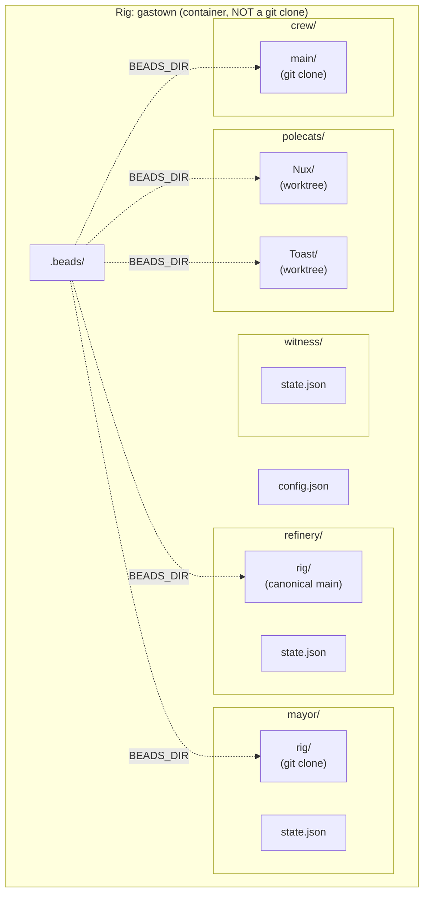

### ASCII Directory Layout

For reference without mermaid rendering (see [harness.md](harness.md) for creation/setup):

```
~/gt/                                    # HARNESS ROOT (Gas Town installation)
├── CLAUDE.md                            # Mayor role context
├── .beads/                              # Town-level beads (gm-* prefix)
│   ├── beads.db                         # Mayor mail, coordination
│   └── config.yaml
│
├── mayor/                               # Mayor configuration and state
│   ├── town.json                        # {"type": "town", "name": "..."}
│   ├── rigs.json                        # Registry of managed rigs
│   └── state.json                       # Mayor agent state
│
├── gastown/                             # RIG (container, NOT a git clone)
│   ├── config.json                      # Rig configuration
│   ├── .beads/ → mayor/rig/.beads       # Symlink to Mayor's canonical beads
│   │
│   ├── mayor/                           # Mayor's per-rig presence
│   │   ├── rig/                         # CANONICAL clone (beads + worktree base)
│   │   │   ├── .git/
│   │   │   ├── .beads/                  # CANONICAL rig beads (gt-* prefix)
│   │   │   └── <project files>
│   │   └── state.json
│   │
│   ├── refinery/                        # Refinery agent (merge queue)
│   │   ├── rig/                         # Refinery's clone (for merges)
│   │   │   ├── .git/
│   │   │   └── <project files>
│   │   └── state.json
│   │
│   ├── witness/                         # Witness agent (pit boss)
│   │   └── state.json                   # No clone needed
│   │
│   ├── crew/                            # Overseer's personal workspaces
│   │   └── <name>/                      # Full clone (inherits beads from rig)
│   │       ├── .git/
│   │       └── <project files>
│   │
│   ├── polecats/                        # Worker directories (worktrees)
│   │   ├── Nux/                         # Git worktree from Mayor's clone
│   │   │   └── <project files>          # (inherits beads from rig)
│   │   └── Toast/                       # Git worktree from Mayor's clone
│   │
│   └── plugins/                         # Optional plugins
│       └── merge-oracle/
│           ├── CLAUDE.md
│           └── state.json
│
└── wyvern/                              # Another rig (same structure)
    ├── config.json
    ├── .beads/ → mayor/rig/.beads
    ├── mayor/
    ├── refinery/
    ├── witness/
    ├── crew/
    └── polecats/
```

**Key changes from earlier design:**
- Town beads (`gm-*`) hold Mayor mail instead of JSONL files
- Mayor has per-rig clone that's canonical for beads and worktrees
- Rig `.beads/` symlinks to Mayor's canonical beads
- Polecats are git worktrees from Mayor's clone (fast)

### Why Decentralized?

Agents live IN rigs rather than in a central location:
- **Locality**: Each agent works in the context of its rig
- **Independence**: Rigs can be added/removed without restructuring
- **Parallelism**: Multiple rigs can have active workers simultaneously
- **Simplicity**: Agent finds its context by looking at its own directory

## Agent Responsibilities

### Mayor

The Mayor is the global coordinator:
- **Work dispatch**: Spawns workers for issues, coordinates batch work on epics
- **Cross-rig coordination**: Routes work between rigs when needed
- **Escalation handling**: Resolves issues Witnesses can't handle
- **Strategic decisions**: Architecture, priorities, integration planning

**NOT Mayor's job**: Per-worker cleanup, session killing, nudging workers

### Witness

The Witness is the per-rig "pit boss":
- **Worker monitoring**: Track polecat health and progress
- **Nudging**: Prompt workers toward completion
- **Pre-kill verification**: Ensure git state is clean before killing sessions
- **Session lifecycle**: Kill sessions, update worker state
- **Self-cycling**: Hand off to fresh session when context fills
- **Escalation**: Report stuck workers to Mayor

**Key principle**: Witness owns ALL per-worker cleanup. Mayor is never involved in routine worker management.

### Refinery

The Refinery manages the merge queue:
- **PR review**: Check polecat work before merging
- **Integration**: Merge completed work to main
- **Conflict resolution**: Handle merge conflicts
- **Quality gate**: Ensure tests pass, code quality maintained

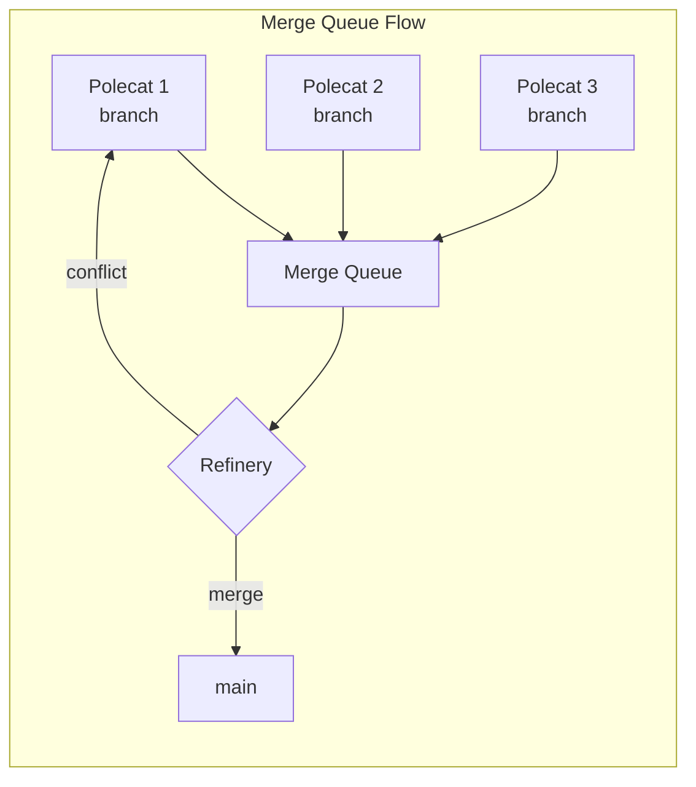

#### Direct Landing (Bypass Merge Queue)

Sometimes Mayor needs to land a polecat's work directly, skipping the Refinery:

| Scenario | Use Direct Landing? |
|----------|---------------------|
| Single polecat, simple change | Yes |
| Urgent hotfix | Yes |
| Refinery unavailable | Yes |
| Multiple polecats, potential conflicts | No - use Refinery |
| Complex changes needing review | No - use Refinery |

**Commands:**

```bash
# Normal flow (through Refinery)
gt merge-queue add <rig> <polecat>     # Polecat signals PR ready
gt refinery process <rig>               # Refinery processes queue

# Direct landing (Mayor bypasses Refinery)
gt land --direct <rig>/<polecat>        # Land directly to main
gt land --direct --force <rig>/<polecat> # Skip safety checks
gt land --direct --skip-tests <rig>/<polecat>  # Skip test run
gt land --direct --dry-run <rig>/<polecat>     # Preview only
```

**Direct landing workflow:**

```mermaid
sequenceDiagram
    participant M as 🎩 Mayor
    participant R as Refinery Clone
    participant P as Polecat Branch
    participant B as 📦 Beads

    M->>M: Verify polecat session terminated
    M->>P: Check git state clean
    M->>R: Fetch polecat branch
    M->>R: Merge to main (fast-forward or merge commit)
    M->>R: Run tests (optional)
    M->>R: Push to origin
    M->>B: Close associated issue
    M->>P: Delete polecat branch (cleanup)
```

**Safety checks (skippable with --force):**
1. Polecat session must be terminated
2. Git working tree must be clean
3. No merge conflicts with main
4. Tests pass (skippable with --skip-tests)

**When direct landing makes sense:**
- Mayor is doing sequential, non-swarming work (like GGT scaffolding)
- Single worker completed an isolated task
- Hotfix needs to land immediately
- Refinery agent is down or unavailable

### Polecat

Polecats are the workers that do actual implementation:
- **Issue completion**: Work on assigned beads issues
- **Self-verification**: Run decommission checklist before signaling done
- **Beads access**: Create issues for discovered work, close completed work
- **Clean handoff**: Ensure git state is clean for Witness verification
- **Shutdown request**: Request own termination via `gt handoff` (bottom-up lifecycle)

**Polecats are ephemeral**: They exist only while working. When done, they request shutdown and are deleted (worktree removed, branch deleted). There is no "idle pool" of polecats.

## Key Workflows

### Work Dispatch

Work flows through the system as a stream. The Overseer spawns workers, they process issues, and completed work enters the merge queue.

```mermaid
sequenceDiagram
    participant O as 👤 Overseer
    participant M as 🎩 Mayor
    participant W as 👁 Witness
    participant P as 🐱 Polecats
    participant R as 🔧 Refinery

    O->>M: Spawn workers for epic
    M->>W: Assign issues to workers
    W->>P: Start work

    loop For each worker
        P->>P: Work on issue
        P->>R: Submit to merge queue
        R->>R: Review & merge
    end

    R->>M: All work merged
    M->>O: Report results
```

**Note**: There is no "swarm ID" or batch boundary. Workers process issues independently. The merge queue handles coordination. "Swarming an epic" is just spawning multiple workers for the epic's child issues.

### Worker Cleanup (Witness-Owned)

```mermaid
sequenceDiagram
    participant P as 🐱 Polecat
    participant W as 👁 Witness
    participant M as 🎩 Mayor
    participant O as 👤 Overseer

    P->>P: Complete work
    P->>W: Done signal

    W->>W: Capture git state
    W->>W: Assess cleanliness

    alt Git state dirty
        W->>P: Nudge (fix issues)
        P->>P: Fix issues
        P->>W: Done signal (retry)
    end

    alt Clean after ≤3 tries
        W->>W: Verify clean
        W->>P: Kill session
    else Stuck after 3 tries
        W->>M: Escalate
        alt Mayor can fix
            M->>W: Resolution
        else Mayor can't fix
            M->>O: Escalate to human
            O->>M: Decision
        end
    end
```

### Polecat Shutdown Protocol (Bottom-Up)

Polecats initiate their own shutdown. This enables streaming - workers come and go continuously without artificial batch boundaries.

```mermaid
sequenceDiagram
    participant P as 🐱 Polecat
    participant R as 🔧 Refinery
    participant W as 👁 Witness

    P->>P: Complete work
    P->>R: Submit to merge queue
    P->>P: Run gt handoff

    Note over P: Verify git clean,<br/>PR exists

    P->>W: Mail: "Shutdown request"
    P->>P: Set state = pending_shutdown

    W->>W: Verify safe to kill
    W->>P: Kill session
    W->>W: git worktree remove
    W->>W: git branch -d
```

**gt handoff command** (run by polecat):
1. Verify git state clean (no uncommitted changes)
2. Verify work handed off (PR created or in queue)
3. Send mail to Witness requesting shutdown
4. Wait for Witness to kill session (don't self-exit)

**Witness shutdown handler**:
1. Receive shutdown request
2. Verify PR merged or queued, no data loss risk
3. Kill session: `gt session stop <rig>/<polecat>`
4. Remove worktree: `git worktree remove polecats/<name>`
5. Delete branch: `git branch -d polecat/<name>`

**Why bottom-up?** In streaming, there's no "swarm end" to trigger cleanup. Each worker manages its own lifecycle. The Witness is the lifecycle authority that executes the actual termination.

### Session Cycling (Mail-to-Self)

When an agent's context fills, it hands off to its next session:

1. **Recognize**: Notice context filling (slow responses, losing track of state)
2. **Capture**: Gather current state (active work, pending decisions, warnings)
3. **Compose**: Write structured handoff note
4. **Send**: Mail handoff to own inbox
5. **Exit**: End session cleanly
6. **Resume**: New session reads handoff, picks up where old session left off

```mermaid
sequenceDiagram
    participant S1 as Agent Session 1
    participant MB as 📬 Mailbox
    participant S2 as Agent Session 2

    S1->>S1: Context filling up
    S1->>S1: Capture current state
    S1->>MB: Send handoff note
    S1->>S1: Exit cleanly

    Note over S1,S2: Session boundary

    S2->>MB: Check inbox
    MB->>S2: Handoff note
    S2->>S2: Resume from handoff state
```

## Key Design Decisions

### 1. Witness Owns Worker Cleanup

**Decision**: Witness handles all per-worker cleanup. Mayor is never involved.

**Rationale**:
- Separation of concerns (Mayor strategic, Witness operational)
- Reduced coordination overhead
- Faster shutdown
- Cleaner escalation path

### 2. Polecats Have Direct Beads Access

**Decision**: Polecats can create, update, and close beads issues directly.

**Rationale**:
- Simplifies architecture (no proxy through Witness)
- Empowers workers to file discovered work
- Faster feedback loop
- Beads v0.30.0+ handles multi-agent conflicts

### 3. Session Cycling via Mail-to-Self

**Decision**: Agents mail handoff notes to themselves when cycling sessions.

**Rationale**:
- Consistent pattern across all agent types
- Timestamped and logged
- Works with existing inbox infrastructure
- Clean separation between sessions

### 4. Decentralized Agent Architecture

**Decision**: Agents live in rigs (`<rig>/witness/rig/`) not centralized (`mayor/rigs/<rig>/`).

**Rationale**:
- Agents work in context of their rig
- Rigs are independent units
- Simpler role detection
- Cleaner directory structure

### 5. Visible Config Directory

**Decision**: Use `config/` not `.gastown/` for town configuration.

**Rationale**: AI models often miss hidden directories. Visible is better.

### 6. Rig as Container, Not Clone

**Decision**: The rig directory is a pure container, not a git clone of the project.

**Rationale**:
- **Prevents confusion**: Agents historically get lost (polecats in refinery, mayor in polecat dirs). If the rig root were a clone, it's another tempting target for confused agents. Two confused agents at once = collision disaster.
- **Single work location**: Each agent has exactly one place to work (their own `/rig/` clone)
- **Clear role detection**: "Am I in a `/rig/` directory?" = I'm in an agent clone
- **Refinery is canonical main**: Refinery's clone serves as the authoritative "main branch" - it pulls, merges PRs, and pushes. No need for a separate rig-root clone.

### 7. Plugins as Agents

**Decision**: Plugins are just additional agents with identities, mailboxes, and access to beads. No special plugin infrastructure.

**Rationale**:
- Fits Gas Town's intentionally rough aesthetic
- Zero new infrastructure needed (uses existing mail, beads, identities)
- Composable - plugins can invoke other plugins via mail
- Debuggable - just look at mail logs and bead history
- Extensible - anyone can add a plugin by creating a directory

**Structure**: `<rig>/plugins/<name>/` with optional `rig/`, `CLAUDE.md`, `mail/`, `state.json`.

### 8. Rig-Level Beads via BEADS_DIR

**Decision**: Each rig has its own `.beads/` directory. Agents use the `BEADS_DIR` environment variable to point to it.

**Rationale**:
- **Centralized issue tracking**: All polecats in a rig share the same beads database
- **Project separation**: Even if the project repo has its own `.beads/`, Gas Town agents use the rig's beads instead
- **OSS-friendly**: For contributing to projects you don't own, rig beads stay separate from upstream
- **Already supported**: Beads supports `BEADS_DIR` env var (see beads `internal/beads/beads.go`)

**Configuration**: Gas Town sets `BEADS_DIR` when spawning agents:
```bash
export BEADS_DIR=/path/to/rig/.beads
```

**See also**: beads issue `bd-411u` for documentation of this pattern.

### 9. Direct Landing Option

**Decision**: Mayor can land polecat work directly, bypassing the Refinery merge queue.

**Rationale**:
- **Flexibility**: Not all work needs merge queue overhead
- **Sequential work**: Mayor doing non-swarming work (like GGT scaffolding) shouldn't need Refinery
- **Emergency path**: Hotfixes can land immediately
- **Resilience**: System works even if Refinery is down

**Constraints**:
- Direct landing still uses Refinery's clone as the canonical main
- Safety checks prevent landing dirty or conflicting work
- Mayor takes responsibility for quality (no Refinery review)

**Commands**:
```bash
gt land --direct <rig>/<polecat>        # Standard direct land
gt land --direct --force <rig>/<polecat> # Skip safety checks
```

### 10. Beads Daemon Awareness

**Decision**: Gas Town must disable the beads daemon for worktree-based polecats.

**Rationale**:
- The beads daemon doesn't track which branch each worktree has checked out
- Daemon can commit beads changes to the wrong branch
- This is a beads limitation, not a Gas Town bug
- Full clones don't have this problem

**Configuration**:
```bash
# For worktree polecats (REQUIRED)
export BEADS_NO_DAEMON=1

# For full-clone polecats (optional)
# Daemon is safe, no special config needed
```

**See also**: beads docs/WORKTREES.md and docs/DAEMON.md for details.

### 11. Work is a Stream (No Swarm IDs)

**Decision**: Work state is encoded in beads epics and issues. There are no "swarm IDs" or separate swarm infrastructure - the epic IS the grouping, the merge queue IS the coordination.

**Rationale**:
- **No new infrastructure**: Beads already provides hierarchy, dependencies, status, priority
- **Shared state**: All rig agents share the same `.beads/` via BEADS_DIR
- **Queryable**: `bd ready` finds work with no blockers, enabling multi-wave orchestration
- **Auditable**: Beads history shows work progression
- **Resilient**: Beads sync handles multi-agent conflicts
- **No boundary problem**: When does a swarm start/end? Who's in it? These questions dissolve - work is a stream

**How it works**:
- Create an epic with child issues for batch work
- Dependencies encode ordering (task B depends on task A)
- Status transitions track progress (open → in_progress → closed)
- Witness queries `bd ready` to find next available work
- Spawn workers as needed - add more anytime
- Batch complete = all child issues closed (or just keep going)

**Example**: Batch work on authentication bugs:
```
gt-auth-epic              # Epic: "Fix authentication bugs"
├── gt-auth-epic.1        # "Fix login timeout" (ready, no deps)
├── gt-auth-epic.2        # "Fix session expiry" (ready, no deps)
└── gt-auth-epic.3        # "Update auth tests" (blocked by .1 and .2)
```

Workers process issues independently. Work flows through the merge queue. No "swarm ID" needed - the epic provides grouping, labels provide ad-hoc queries, dependencies provide sequencing.

### 12. Agent Session Lifecycle (One Daemon)

**Decision**: ONE daemon (Go process) for all Gas Town manages agent lifecycles. Agents use a unified `gt handoff` command to request lifecycle actions.

**Architecture**:
```
Gas Town Daemon (gt daemon)
├── Pokes Mayor periodically
├── Pokes all Witnesses periodically
├── Processes lifecycle requests from deacon/ inbox
└── Restarts sessions when cycle requested

Lifecycle Hierarchy:
  Daemon → manages Mayor, all Witnesses
  Witness → manages Polecats, Refinery (per rig)
```

**Rationale**:
- Agents can't restart themselves after exiting
- ONE daemon is simpler than per-rig daemons
- Daemon is dumb scheduler; intelligence is in agents
- Unified protocol means all agents work the same way

**Unified lifecycle command** (`gt handoff`):
```bash
gt handoff              # Context-aware default
gt handoff --shutdown   # Terminate, don't restart (polecats)
gt handoff --cycle      # Restart with handoff (long-running agents)
gt handoff --restart    # Fresh restart, no handoff
```

| Agent | Default | Sends request to |
|-------|---------|------------------|
| Polecat | --shutdown | rig/witness |
| Refinery | --cycle | rig/witness |
| Witness | --cycle | deacon/ |
| Mayor | --cycle | deacon/ |

**Lifecycle request protocol**:
1. Agent runs `gt handoff` (verifies git clean, sends handoff mail)
2. Agent sends lifecycle request to its manager
3. Agent sets `requesting_<action>: true` in state.json
4. Agent waits (does NOT self-exit)
5. Manager receives request, verifies safe
6. Manager kills session
7. Manager starts new session (for cycle/restart)
8. New session reads handoff mail, resumes work

**Daemon heartbeat loop**:
- Poke Mayor: "HEARTBEAT: check your rigs"
- Poke each Witness: "HEARTBEAT: check your workers"
- Agents ignore poke if already working
- Process any lifecycle requests in deacon/ inbox
- Restart dead sessions if cycle was requested

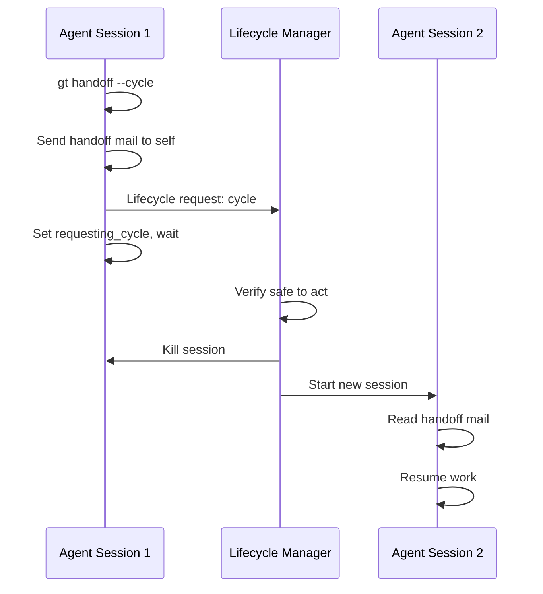

**Polecat shutdown** (--shutdown default):
After Witness kills session:
- Remove worktree: `git worktree remove polecats/<name>`
- Delete branch: `git branch -d polecat/<name>`
- Polecat ceases to exist (ephemeral)

### 13. Resource-Constrained Worker Pool

**Decision**: Each rig has a configurable `max_workers` limit for concurrent polecats.

**Rationale**:
- Claude Code can use 500MB+ RAM per session
- Prevents resource exhaustion on smaller machines
- Enables autonomous operation without human oversight
- Witness respects limit when spawning new workers

**Configuration** (in rig config.json):
```json
{
  "type": "rig",
  "max_workers": 8,
  "worker_spawn_delay": "5s"
}
```

**Witness behavior**:
- Query active worker count before spawning
- If at limit, wait for workers to complete
- Prioritize higher-priority ready issues

### 14. Outpost Abstraction for Federation

**Decision**: Federation uses an "Outpost" abstraction to support multiple compute backends (local, SSH/VM, Cloud Run, etc.) through a unified interface.

**Rationale**:
- Different workloads need different compute: burst vs long-running, cheap vs fast
- Cloud Run's pay-per-use model is ideal for elastic burst capacity
- VMs are better for autonomous long-running work
- Local is always the default for development
- Platform flexibility lets users choose based on their needs and budget

**Key insight**: Cloud Run's persistent HTTP/2 connections solve the "zero to one" cold start problem, making container workers viable for interactive-ish work at ~$0.017 per 5-minute session.

**Design principles**:
1. **Local-first** - Remote outposts are overflow, not primary
2. **Git remains source of truth** - All outposts sync via git
3. **HTTP for Cloud Run** - Don't force filesystem mail onto containers
4. **Graceful degradation** - System works with any subset of outposts

**See**: `docs/federation-design.md` for full architectural analysis.

## Multi-Wave Work Processing

For large task trees (like implementing GGT itself), workers can process multiple "waves" of work automatically based on the dependency graph.

### Wave Orchestration

A wave is not explicitly managed - it emerges from dependencies:

1. **Wave 1**: All issues with no dependencies (`bd ready`)
2. **Wave 2**: Issues whose dependencies are now closed
3. **Wave N**: Continue until all work is done

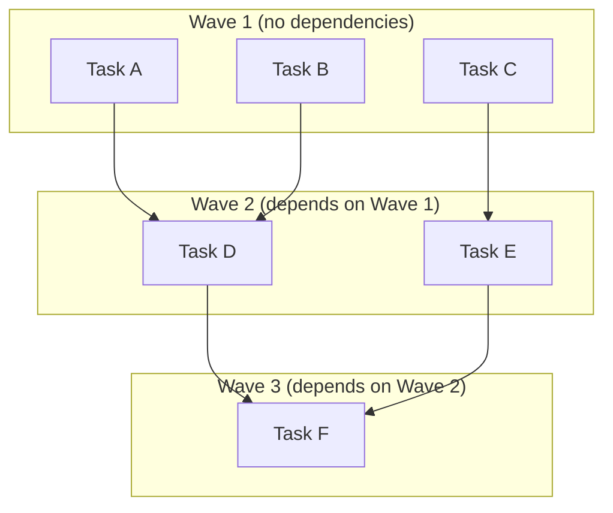

### Witness Work Loop

```
while epic has open issues:
    ready_issues = bd ready --parent <epic-id>

    if ready_issues is empty and workers_active:
        wait for worker completion
        continue

    for issue in ready_issues:
        if active_workers < max_workers:
            spawn worker for issue
        else:
            break  # wait for capacity

    monitor workers, handle completions

all work complete - report to Mayor
```

### Long-Running Autonomy

With daemon session cycling, the system can run autonomously for extended periods:

- **Witness cycles**: Every few hours as context fills
- **Refinery cycles**: As merge queue grows complex
- **Workers cycle**: If individual tasks are very large
- **Daemon persistence**: Survives all agent restarts

The daemon is the only truly persistent component. All agents are ephemeral sessions that hand off state via mail.

Work is a continuous stream - you can add new issues, spawn new workers, reprioritize the queue, all without "starting a new swarm" or managing batch boundaries.

## Configuration

### town.json

```json
{
  "type": "town",
  "version": 1,
  "name": "stevey-gastown",
  "created_at": "2024-01-15T10:30:00Z"
}
```

### rigs.json

```json
{
  "version": 1,
  "rigs": {
    "wyvern": {
      "git_url": "https://github.com/steveyegge/wyvern",
      "added_at": "2024-01-15T10:30:00Z"
    }
  }
}
```

### rig.json (Per-Rig Config)

Each rig has a `config.json` at its root:

```json
{
  "type": "rig",
  "version": 1,
  "name": "wyvern",
  "git_url": "https://github.com/steveyegge/wyvern",
  "beads": {
    "prefix": "wyv",
    "sync_remote": "origin"    // Optional: git remote for bd sync
  }
}
```

The rig's `.beads/` directory is always at the rig root. Gas Town:
1. Creates `.beads/` when adding a rig (`gt rig add`)
2. Runs `bd init --prefix <prefix>` to initialize it
3. Sets `BEADS_DIR` environment variable when spawning agents

This ensures all agents in the rig share a single beads database, separate from any beads the project itself might use.

## CLI Commands

### Harness Management

```bash
gt install [path]      # Create Gas Town harness (see harness.md)
gt install --git       # Also initialize git with .gitignore
gt install --github=u/r  # Also create GitHub repo
gt git-init            # Initialize git for existing harness
gt doctor              # Check workspace health
gt doctor --fix        # Auto-fix issues
```

### Agent Operations

```bash
gt status              # Overall town status
gt rigs                # List all rigs
gt polecats <rig>      # List polecats in a rig
```

### Communication

```bash
gt inbox               # Check inbox
gt send <addr> -s "Subject" -m "Message"
gt inject <polecat> "Message"    # Direct injection to session
gt capture <polecat> "<cmd>"     # Run command in polecat session
```

### Session Management

```bash
gt spawn --issue <id>  # Start polecat on issue (creates fresh worktree)
gt handoff             # Polecat requests shutdown (run when done)
gt session stop <p>    # Kill polecat session (Witness uses this)
```

**Note**: `gt wake` and `gt sleep` are deprecated - polecats are ephemeral, not pooled.

### Landing & Merge Queue

```bash
gt merge-queue add <rig> <polecat>  # Add to merge queue (normal flow)
gt merge-queue list <rig>           # Show pending merges
gt refinery process <rig>           # Trigger Refinery to process queue

gt land --direct <rig>/<polecat>    # Direct landing (bypass Refinery)
gt land --direct --force ...        # Skip safety checks
gt land --direct --skip-tests ...   # Skip test verification
gt land --direct --dry-run ...      # Preview only
```

### Emergency Operations

```bash
gt stop --all              # Kill ALL sessions (emergency halt)
gt stop --rig <name>       # Kill all sessions in one rig
gt doctor --fix            # Auto-repair common issues
```

## Plugins

Gas Town supports **plugins** - but in the simplest possible way: plugins are just more agents.

### Philosophy

Gas Town is intentionally rough and lightweight. A "credible plugin system" with manifests, schemas, and invocation frameworks would be pretentious for a project named after a Mad Max wasteland. Instead, plugins follow the same patterns as all Gas Town agents:

- **Identity**: Plugins have persistent identities like polecats and witnesses
- **Communication**: Plugins use mail for input/output
- **Artifacts**: Plugins produce beads, files, or other handoff artifacts
- **Lifecycle**: Plugins can be invoked on-demand or at specific workflow points

### Plugin Structure

Plugins live in a rig's `plugins/` directory:

```
wyvern/                            # Rig
├── plugins/
│   └── merge-oracle/              # A plugin
│       ├── rig/                   # Plugin's git clone (if needed)
│       ├── CLAUDE.md              # Plugin's instructions/prompts
│       ├── mail/inbox.jsonl       # Plugin's mailbox
│       └── state.json             # Plugin state (optional)
```

That's it. No plugin.yaml, no special registration. If the directory exists, the plugin exists.

### Invoking Plugins

Plugins are invoked like any other agent - via mail:

```bash
# Refinery asks merge-oracle to analyze pending changesets
gt send wyvern/plugins/merge-oracle -s "Analyze merge queue" -m "..."

# Mayor asks plan-oracle for a work breakdown
gt send beads/plugins/plan-oracle -s "Plan for bd-xyz" -m "..."
```

Plugins do their work (potentially spawning Claude sessions) and respond via mail, creating any necessary artifacts (beads, files, branches).

### Hook Points

Existing agents can be configured to notify plugins at specific points. This is just convention - agents check if a plugin exists and mail it:

| Workflow Point | Agent | Example Plugin |
|----------------|-------|----------------|
| Before merge processing | Refinery | merge-oracle |
| Before work dispatch | Mayor | plan-oracle |
| On worker stuck | Witness | debug-oracle |
| On PR ready | Refinery | review-oracle |

Configuration is minimal - perhaps a line in the agent's CLAUDE.md or state.json noting which plugins to consult.

### Example: Merge Oracle

The **merge-oracle** plugin analyzes changesets before the Refinery processes them:

**Input** (via mail from Refinery):
- List of pending changesets
- Current merge queue state

**Processing**:
1. Build overlap graph (which changesets touch same files/regions)
2. Classify disjointness (fully disjoint → parallel safe, overlapping → needs sequencing)
3. Use LLM to assess semantic complexity of overlapping components
4. Identify high-risk patterns (deletions vs modifications, conflicting business logic)

**Output**:
- Bead with merge plan (parallel groups, sequential chains)
- Mail to Refinery with recommendation (proceed / escalate to Mayor)
- If escalation needed: mail to Mayor with explanation

The merge-oracle's `CLAUDE.md` contains the prompts and classification criteria. Gas Town doesn't need to know the internals.

### Example: Plan Oracle

The **plan-oracle** plugin helps decompose work:

**Input**: An issue/epic that needs breakdown

**Processing**:
1. Analyze the scope and requirements
2. Identify dependencies and blockers
3. Estimate complexity (for parallelization decisions)
4. Suggest task breakdown

**Output**:
- Beads for the sub-tasks (created via `bd create`)
- Dependency links (via `bd dep add`)
- Mail back with summary and recommendations

### Why This Design

1. **Fits Gas Town's aesthetic**: Rough, text-based, agent-shaped
2. **Zero new infrastructure**: Uses existing mail, beads, identities
3. **Composable**: Plugins can invoke other plugins
4. **Debuggable**: Just look at mail logs and bead history
5. **Extensible**: Anyone can add a plugin by creating a directory

### Plugin Discovery

```bash
gt plugins <rig>           # List plugins in a rig
gt plugin status <name>    # Check plugin state
```

Or just `ls <rig>/plugins/`.

## Failure Modes and Recovery

Gas Town is designed for resilience. Common failure modes and their recovery:

| Failure | Detection | Recovery |
|---------|-----------|----------|
| Agent crash | Session gone, state shows 'working' | `gt doctor` detects, reset state to idle |
| Git dirty state | Witness pre-kill check fails | Nudge worker, or manual commit/discard |
| Beads sync conflict | `bd sync` fails | Beads tombstones handle most cases |
| Tmux crash | All sessions inaccessible | `gt doctor --fix` cleans up |
| Stuck work | No progress for 30+ minutes | Witness escalates, Overseer intervenes |
| Disk full | Write operations fail | Clean logs, remove old clones |

### Recovery Principles

1. **Fail safe**: Prefer stopping over corrupting data
2. **State is recoverable**: Git and beads have built-in recovery
3. **Doctor heals**: `gt doctor --fix` handles common issues
4. **Emergency stop**: `gt stop --all` as last resort
5. **Human escalation**: Some failures need Overseer intervention

### Doctor Checks

`gt doctor` performs health checks at both workspace and rig levels:

**Workspace checks**: Config validity, Mayor mailbox, rig registry
**Rig checks**: Git state, clone health, Witness/Refinery presence
**Work checks**: Stuck detection, zombie sessions, heartbeat health

Run `gt doctor` regularly. Run `gt doctor --fix` to auto-repair issues.

## Federation: Outposts

Federation enables Gas Town to scale across machines via **Outposts** - remote compute environments that can run workers.

**Full design**: See `docs/federation-design.md`

### Outpost Types

| Type | Description | Cost Model | Best For |
|------|-------------|------------|----------|
| Local | Current tmux model | Free | Development, primary work |
| SSH/VM | Full Gas Town clone on VM | Always-on | Long-running, autonomous |
| CloudRun | Container workers on GCP | Pay-per-use | Burst, elastic, background |

### Core Abstraction

```go
type Outpost interface {
    Name() string
    Type() OutpostType  // local, ssh, cloudrun
    MaxWorkers() int
    ActiveWorkers() int
    Spawn(issue string, config WorkerConfig) (Worker, error)
    Workers() []Worker
    Ping() error
}

type Worker interface {
    ID() string
    Outpost() string
    Status() WorkerStatus  // idle, working, done, failed
    Issue() string
    Attach() error         // for interactive outposts
    Logs() (io.Reader, error)
    Stop() error
}
```

### Configuration

```yaml
# ~/gt/config/outposts.yaml
outposts:
  - name: local
    type: local
    max_workers: 4

  - name: gce-burst
    type: ssh
    host: 10.0.0.5
    user: steve
    town_path: /home/steve/ai
    max_workers: 8

  - name: cloudrun-burst
    type: cloudrun
    project: my-gcp-project
    region: us-central1
    service: gastown-worker
    max_workers: 20
    cost_cap_hourly: 5.00

policy:
  default_preference: [local, gce-burst, cloudrun-burst]
```

### Cloud Run Workers

Cloud Run enables elastic, pay-per-use workers:
- **Persistent HTTP/2 connections** solve cold start (zero-to-one) problem
- **Cost**: ~$0.017 per 5-minute worker session
- **Scaling**: 0→N automatically based on demand
- **When idle**: Scales to zero, costs nothing

Workers receive work via HTTP, clone code from git, run Claude, push results. No filesystem mail needed - HTTP is the control plane.

### SSH/VM Outposts

Full Gas Town clone on remote machines:
- **Model**: Complete town installation via SSH
- **Workers**: Remote tmux sessions
- **Sync**: Git for code and beads
- **Good for**: Long-running work, full autonomy if disconnected

### Design Principles

1. **Outpost abstraction** - Support multiple backends via unified interface
2. **Local-first** - Remote outposts are for overflow/burst, not primary
3. **Git as source of truth** - Code and beads sync everywhere
4. **HTTP for Cloud Run** - Don't force mail onto stateless containers
5. **Graceful degradation** - System works with any subset of outposts

### Architecture Diagram

```
┌─────────────────────────────────────────────────────────────┐
│                         MAYOR                                │
│  ┌──────────────────────────────────────────────────────┐   │
│  │               Outpost Manager                         │   │
│  │  - Tracks all registered outposts                     │   │
│  │  - Routes work to appropriate outpost                 │   │
│  │  - Monitors worker status across outposts             │   │
│  └──────────────────────────────────────────────────────┘   │
│         │              │                │                    │
│         ▼              ▼                ▼                    │
│  ┌──────────┐   ┌──────────┐     ┌──────────────┐           │
│  │  Local   │   │   SSH    │     │   CloudRun   │           │
│  │ Outpost  │   │ Outpost  │     │   Outpost    │           │
│  └────┬─────┘   └────┬─────┘     └──────┬───────┘           │
└───────┼──────────────┼──────────────────┼───────────────────┘
        │              │                  │
        ▼              ▼                  ▼
   ┌─────────┐   ┌─────────┐        ┌─────────────┐
   │  tmux   │   │  SSH    │        │  HTTP/2     │
   │ panes   │   │sessions │        │ connections │
   └─────────┘   └─────────┘        └─────────────┘
        │              │                  │
        └──────────────┼──────────────────┘
                       ▼
              ┌─────────────────┐
              │   Git Repos     │
              │  (code + beads) │
              └─────────────────┘
```

### CLI Commands

```bash
gt outpost list              # List configured outposts
gt outpost status [name]     # Detailed status
gt outpost add <type> ...    # Add new outpost
gt outpost ping <name>       # Test connectivity
```

### Implementation Status

Federation is tracked in **gt-9a2** (P3 epic). Key tasks:
- `gt-9a2.1`: Outpost/Worker interfaces
- `gt-9a2.2`: LocalOutpost (refactor current spawning)
- `gt-9a2.5`: SSHOutpost
- `gt-9a2.8`: CloudRunOutpost

## Implementation Status

Gas Town is being ported from Python (gastown-py) to Go (gastown). The Go port (GGT) is in development:

- **Epic**: gt-u1j (Port Gas Town to Go)
- **Scaffolding**: gt-u1j.1 (Go scaffolding - blocker for implementation)
- **Management**: gt-f9x (Town & Rig Management: install, doctor, federation)

See beads issues with `bd list --status=open` for current work items.
